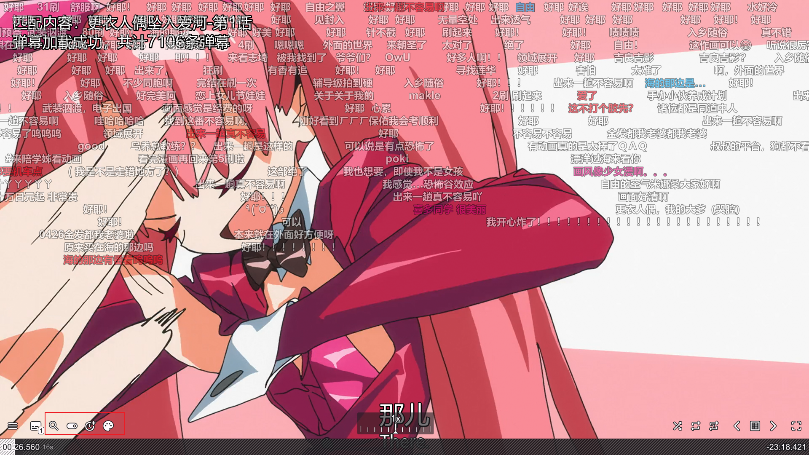

# fntv-electron 桌面客户端


飞牛影视桌面客户端，基于Electron构建，提供更好的桌面体验和增强功能。




[演示视频](https://www.bilibili.com/video/BV12dYXzhE6U/)

## ✨ 主要功能

- **原生桌面体验** - 基于飞牛影视Web端构建的桌面应用，提供类原生体验
- **自动登录** - 支持自动登录，支持多账户管理，自由切换账户和服务器
- **硬解播放** - 支持H264 / HEVC / VP9 / AV1，具体支持查看下面感谢项目
- **直链播放** - 支持调用内置MPV播放器直链播放视频(支持网盘挂载)，支持播放进度回传
- **弹幕支持** - MPV播放器支持弹幕自动匹配加载，无法匹配时支持手动搜索
- **跨平台支持** - 支持windows、macos和linux

## 爱发电

<a href="https://afdian.com/a/qiaoke" target="_blank">
  
</a>

您的每一次 star ⭐ 和 赞助 🎁 都是我持续优化的动力。让我们一起维护这个用爱发电的项目！

## 更新记录

* 2025.8.27 - v2.0.0 **重大更新**

1. 支持跨平台winx64 ,mac arm/intel, linux
2. 默认关闭原有播放逻辑，登录页面右下角添加开关，可以恢复原有播放逻辑
3. 弹幕插件支持跨平台，mac,linux,windows可正常使用
4. mpv播放器支持视频播放列表，能够正常进行进度回传

* 2025.8.27 - v1.7.2 支持所有页面小按钮弹出二级弹窗，选择是否mpv播放
* 2025.8.26 - v1.7.1 支持记录客户端日志到%appdata%/fntv/logs，增强可排障性，数据脱敏处理
* 2025.8.24 - v1.7.0 支持自动检查更新，登录界面支持配置github代理
* 2025.8.24 - v1.6.4 mpv配置管理抽为单独仓库，支持Anime4K着色器预设方案
* 2025.8.23 - v1.6.3 优化mpv启动参数，固定启动时的初始窗口大小
* 2025.8.22 - v1.6.2 修改部分快捷键为potplayer常用键位，mpv播放器改为无边框
* 2025.8.21 - v1.6.1 修复缓存目录过大，超过100m自动清理
* 2025.8.21 - v1.6.0 支持登录界面填写服务器地址，支持多用户管理，关闭支持托盘
* 2025.8.20 - v1.5.0 所有可播放页面添加mpv播放按钮，mpv播放结束自动刷新页面，可继续点击观看下一集
* 2025.8.19 - v1.4.0 MPV播放器支持弹幕自动加载，无法识别时可手动搜索
* 2025.8.19 - v1.3.0 支持MPV播放器播放进度回传，优化mpv播放器配置
* 2025.8.18 - v1.2.0 MPV播放器支持自动读取外挂字幕
* 2025.8.17 - v1.1.0 支持视频直链解析，拒绝转码，使用内置mpv播放器播放(只支持剧集页和电影播放页)，暂不支持上报播放进度
* 2025.8.16 - v1.0.0 浏览器解码集成H264 / HEVC / VP9 / AV1
* 2025.8.15 - v1.0.0 飞牛客户端初版支持, 支持持久化登录信息

## 📦 安装方法

### 预编译版本

前往 [Releases页面](https://github.com/QiaoKes/fntv-electron/releases) 下载最新版本：

* 文件名: `FNMedia_${version}_${os}_${arch}.exe`

1.字段含义：

- version：版本号
- os：操作系统
- arch：系统架构

2.安装步骤

- windows直接安装即可使用
- macos请使用brew安装mpv

```bash
brew install mpv
# 安装dmg后执行
sudo xattr -rd com.apple.quarantine /Applications/飞牛影视.app
```

- linux请先安装mpv播放器再使用

### 从源码构建

1. 克隆仓库：

```bash
git clone https://github.com/QiaoKes/fntv-electron.git
cd fntv-electron
```

2. 下载第三方依赖

```bash
# Windows
# 1.下载https://github.com/QiaoKes/fntv-electron/releases/tag/v0.0.0中的electron-v36.2.1-patch-win32-x64.zip
# 解压到third_party中的electron文件夹中
# 2.下载https://github.com/QiaoKes/fntv-mpv-config/releases
# 解压到third_party中的fntv-mpv文件夹中
```

3. 安装依赖：

```bash
npm i
```

4. 运行开发模式：

```bash
npm start
```

5. 构建安装包：

```bash
# Windows
# 进入到C:\Users\{your_user_name}\AppData\Local\electron\Cache
# 创建文件夹b3ef7c180a968a1775be99205920d296f99e12cd36db5a1b9a5a2a3bb292f8ae
# 将electron-v36.2.1-patch-win32-x64.zip拷贝到文件夹内
npm run build
```

## 常用问题Q&A

### 1. 直接播放无法客户端硬解，还是在服务端解码？

只有mpv播放能保证直链硬解，其余的虽然浏览器支持了硬解，但是飞牛网页端识别有问题，还是会走服务端转码，需要飞牛修复。

### 2. mpv播放器功能有点少，怎么客制化，想添加补帧滤镜等？

1. 自动方法
   克隆fntv-mpv仓库，自己改一下相关配置：[fntv-mpv-config](https://github.com/QiaoKes/fntv-mpv-config)
2. 手动方法
   打开你安装目录的third_party，只修改third_party\fntv-mpv\portable_config下面的插件，其余的不要动。其中input.conf是快捷键。

注意重新安装或者更新，会清空安装目录，注意备份你的mpv插件目录。

### 3. 是否支持网盘挂载播放？

支持，飞牛官方挂载的不支持302，需要官方支持。alist没有测试过，可以试一试。

### 4. 能否支持potplayer？

目前我这边没有使用potplayer的需求，如果需要的话可以自行修改源码适配一下。

### 5. 是否支持飞牛connect登录？

官方未开放相关API，无法支持。

### 6. 域名账号密码正确但是无法登录？

只支持正常dns解析的域名，和IP，其余的不支持。

### 7. 弹幕相关问题？

弹幕问题查看uosc_danmaku的文档，根据文档内容调整配置。

### 8. 遇到dandanplay.exe报毒？

已去除二进制文件，请更新到最新版本，go的二进制压缩会被误报。可以查看这个issue，二进制由dandanplay提供 https://github.com/Tony15246/uosc_danmaku/issues/267

### 9.登录完客户端后，如果服务器连接不上登录会超时卡透明屏，无法切换或修改服务器配置，卸载重装也不行

去C:\\Users\\{你的计算机用户名}\\.fntv 下面把config.json删除了，因为连接成功后实际上加载的还是飞牛网页端，没响应当然会透明了。

### 10.打开弹幕视频掉帧

打开弹幕时，默认开启fps平滑滤镜，比较吃性能，不需要可以去安装目录下的third_party\fntv-mpv\portable_config\script-opts下uosc_danmaku.conf关闭相关配置

### 11.双显卡，调用时发现使用核显

以下两种方法任选其一：

1) NVIDIA控制面板-管理3D设置-程序设置-添加飞牛影视-应用
2) 设置-系统-屏幕-图形显示-添加飞牛影视-选择高性能

## ⌨️ MPV播放器

1. 快捷键

```text
部分快捷键兼容potpolyer
查看安装目录下
third_party\fntv-mpv\portable_config\input.conf
```

2. MPV配置由以下仓库单独管理:
   [fntv-mpv-config](https://github.com/QiaoKes/fntv-mpv-config)
3. 预设着色器方案
   [mpv.conf](https://github.com/QiaoKes/fntv-mpv-config/blob/release/custom_config/mpv/mpv.conf)

## 🙏 特别感谢

本项目参考以下开源项目：

- [enable-chromium-hevc-hardware-decoding](https://github.com/StaZhu/enable-chromium-hevc-hardware-decoding) - Chromium HEVC硬解码支持
- [electron-media-patch](https://github.com/5rahim/electron-media-patch) - Electron硬解码补丁
- [fnToPotplayer](https://github.com/gudqs7/fnToPotplayer) - 飞牛影视调用Potplayer
- [fnos-tv](https://github.com/thshu/fnos-tv) - fnos-tv 支持弹幕的飞牛影视
- [mpv弹幕插件](https://github.com/Tony15246/uosc_danmaku) - uosc_danmaku 基于uosc的弹幕插件

## 🛠️ 开发指南

### 项目结构

```
fntv-electron/
├── third_party/          # 三方依赖
├── resource/             # 示例图片
├── release/              # 编译包目录
├── build/                # 构建资源
├── src/                  # 源码
├── config.json           # 调试用服务器地址配置
└── package.json
```

## 📄 许可证

本项目采用 [GPL3.0 许可证](LICENSE)

---

**温馨提示**：本项目为第三方客户端，与飞牛影视官方无关。使用前请确保遵守相关服务条款。
