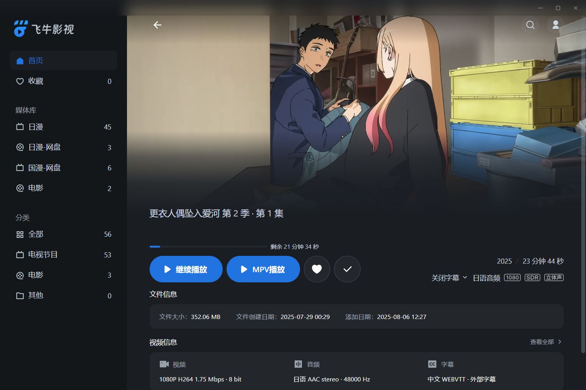

# fntv-electron 桌面客户端


飞牛影视桌面客户端，基于Electron构建，提供更好的桌面体验和增强功能。





## ✨ 主要功能

- **原生桌面体验** - 将飞牛影视Web版封装为原生应用，F11全屏缩放
- **自动登录** - 支持cookie保存，避免重复登录
- **硬解播放** - 支持H264 / HEVC / VP9 / AV1，具体支持查看下面感谢项目
- **直链播放** - 支持调用内置MPV播放器播放视频，支持进度回传
- **弹幕支持** - MPV支持弹幕自动加载，无法匹配时支持手动搜索

## 更新记录

* 2025.8.19 - v1.4.0 MPV播放器支持弹幕自动加载，无法识别时可手动搜索
* 2025.8.19 - v1.3.0 支持MPV播放器播放进度回传，优化mpv播放器配置
* 2025.8.18 - v1.2.0 MPV播放器支持自动读取外挂字幕
* 2025.8.17 - v1.1.0 支持视频直链解析，拒绝转码，使用内置mpv播放器播放(只支持剧集页和电影播放页)，暂不支持上报播放进度
* 2025.8.16 - v1.0.0 浏览器解码集成H264 / HEVC / VP9 / AV1
* 2025.8.15 - v1.0.0 飞牛客户端初版支持, 支持持久化登录信息

## 🙏 特别感谢

本项目参考以下开源项目：

- [enable-chromium-hevc-hardware-decoding](https://github.com/StaZhu/enable-chromium-hevc-hardware-decoding) - Chromium HEVC硬解码支持
- [electron-media-patch](https://github.com/5rahim/electron-media-patch) - Electron硬解码补丁
- [fnToPotplayer](https://github.com/gudqs7/fnToPotplayer) - 飞牛影视调用Potplayer
- [fnos-tv](https://github.com/thshu/fnos-tv) - fnos-tv 支持弹幕的飞牛影视
- [mpv弹幕插件](https://github.com/Tony15246/uosc_danmaku) - uosc_danmaku 基于uosc的弹幕插件

## 📦 安装方法

### 预编译版本

前往 [Releases页面](https://github.com/QiaoKes/fntv-electron/releases) 下载最新版本：

* Windows: `fFNMedia_{version}_{protoctl}_{domain}_{port}.exe`

1.字段含义：

- version：版本号，默认
- protocol：协议，http/https，必填
- domain：你的服务器域名或者ip，必填
- port：你的服务器端口，选填

2.(重要！)按照你的服务器实际地址修改安装包名，以下为几种例子：

- FNMedia_1.0.0_https_nas.test.top_4000.exe
- FNMedia_1.0.0_https_nas.test.top.exe
- FNMedia_1.0.0_http_10.0.0.115_4000.exe

3.直接安装即可使用

### 从源码构建

1. 克隆仓库：

```bash
git clone https://github.com/QiaoKes/fntv-electron.git
cd fntv-electron
# 下载https://github.com/QiaoKes/fntv-electron/releases中的third_party.zip
#解压到third_party中
```

2. 安装依赖：

```bash
npm i
```

3. 运行开发模式：

```bash
# 修改config.json下的server为你的服务器地址
npm start
```

4. 构建安装包：

```bash
# Windows
# 进入到C:\Users\{your_user_name}\AppData\Local\electron\Cache
# 创建文件夹b3ef7c180a968a1775be99205920d296f99e12cd36db5a1b9a5a2a3bb292f8ae
# 将third_party下的electron-v36.2.1-patch-win32-x64.zip拷贝到文件夹内
npm run build
```

## 🛠️ 开发指南

### 项目结构

```
fntv-electron/
├── third_party/          # 三方依赖
├── resource/             # 示例图片
├── release/              # 编译包目录
├── build/                # 构建资源
├── src/                  # 源码
├── config.json           # 调试用服务器地址配置
└── package.json
```

## 📄 许可证

本项目采用 [MIT 许可证](LICENSE)

---

**温馨提示**：本项目为第三方客户端，与飞牛影视官方无关。使用前请确保遵守相关服务条款。
