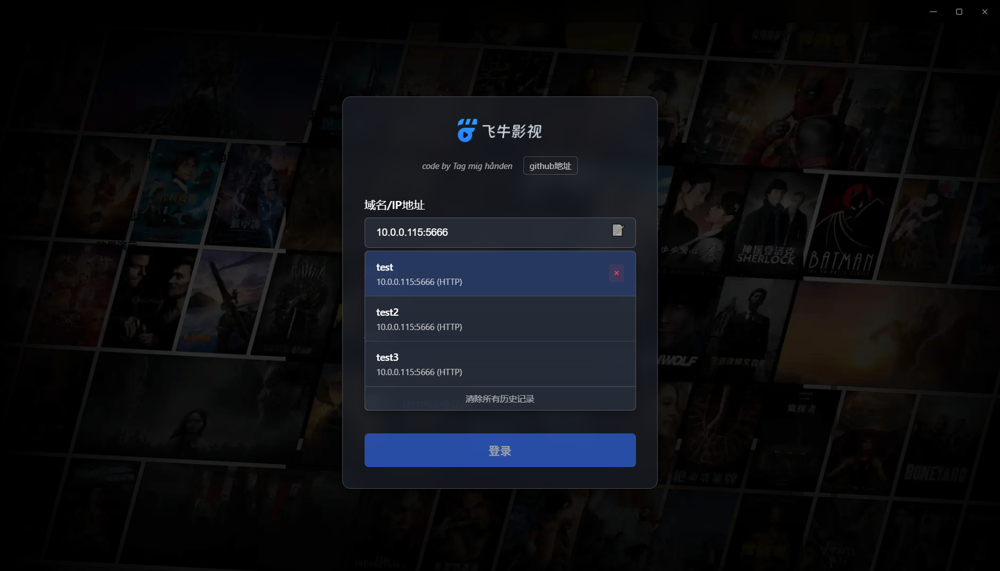

# fntv-electron 桌面客户端


飞牛影视桌面客户端，基于Electron构建，提供更好的桌面体验和增强功能。




[演示视频](https://www.bilibili.com/video/BV12dYXzhE6U/)

## ✨ 主要功能

- **原生桌面体验** - 基于飞牛影视Web端构建的桌面应用，提供类原生体验
- **多账户管理** - 支持自动登录，支持多账户管理，自由切换账户和服务器
- **硬解播放** - 支持H264 / HEVC / VP9 / AV1，具体支持查看下面感谢项目
- **直链播放** - 适配官方直链播放，默认使用直链，可以在托盘处调整为nas代理模式
- **进度回传** - mpv播放器支持实时将进度回传到飞牛服务器
- **弹幕支持** - MPV播放器支持弹幕自动匹配加载，无法匹配时支持手动搜索
- **视频增强** - 内置anime4K着色器以及对应预设模式
- **智能跳过** - 可在MPV播放器界面设置。支持三种跳过片头片尾模式：章节检查，手动设置片头片尾，快捷键跳过固定时长
- **跨平台支持** - 支持windows、macos和linux

## 爱发电

<a href="https://afdian.com/a/qiaoke" target="_blank">
  
</a>

您的每一次 star ⭐ 和 赞助 🎁 都是我持续优化的动力。让我们一起维护这个用爱发电的项目！

## 赞助者

感谢这些来自爱发电的赞助者：

<!-- AFDIAN-ACTION:START -->

<a href="https://afdian.com/u/f9548ae809f311ef805e52540025c377">
    
</a>
<a href="https://afdian.com/u/4514cc8c9a8411f0992b52540025c377">
    
</a>
<a href="https://afdian.com/u/2685303096b611f0b4a652540025c377">
    
</a>
<a href="https://afdian.com/u/8a03268e8ba411f0bcbb52540025c377">
    
</a>

<details>
  <summary>点我 打开/关闭 赞助者列表</summary>

<a href="https://afdian.com/u/f9548ae809f311ef805e52540025c377">
1
</a>
<span>( 1 次赞助, 共 ￥10 ) 留言: fntv</span><br>
<a href="https://afdian.com/u/4514cc8c9a8411f0992b52540025c377">
爱发电用户_4514c
</a>
<span>( 1 次赞助, 共 ￥10 ) 留言: </span><br>
<a href="https://afdian.com/u/2685303096b611f0b4a652540025c377">
嬴游仙人莫迪
</a>
<span>( 1 次赞助, 共 ￥60 ) 留言: 谢谢，我是真的很喜欢...</span><br>
<a href="https://afdian.com/u/8a03268e8ba411f0bcbb52540025c377">
爱发电用户_e6g3
</a>
<span>( 1 次赞助, 共 ￥20 ) 留言: 给几个建议我是mac...</span><br>

</details>
<!-- 注意: 尽量将标签前靠,否则经测试可能被 GitHub 解析为代码块 -->

<!-- AFDIAN-ACTION:END -->

## 📦 安装方法

### 预编译版本

前往 [Releases页面](https://github.com/QiaoKes/fntv-electron/releases) 下载最新版本：

* 文件名: `FNMedia_${version}_${os}_${arch}.${ext}`

1.字段含义：

- version：版本号
- os：操作系统
- arch：系统架构
- ext：文件扩展名

2.安装步骤

- windows直接安装即可使用
- macos请使用brew安装mpv

```bash
brew install mpv
# 安装dmg后执行
sudo xattr -rd com.apple.quarantine /Applications/飞牛影视.app
```

- linux请先安装mpv播放器(版本>0.37.0)再使用，插件前往[fntv-mpv](https://github.com/QiaoKes/fntv-mpv-config/releases) 自行安装

### 从源码构建

1. 克隆仓库：

```bash
git clone https://github.com/QiaoKes/fntv-electron.git
cd fntv-electron
```

2. 下载第三方依赖

```bash
# Windows
# 1.下载https://github.com/QiaoKes/fntv-electron/releases/tag/v0.0.0中的electron-v36.2.1-patch-win32-x64.zip
# 解压到third_party中的electron文件夹中
# 2.下载https://github.com/QiaoKes/fntv-mpv-config/releases
# 解压到third_party中的fntv-mpv文件夹中
```

3. 安装依赖：

```bash
npm i
```

4. 运行开发模式：

```bash
npm start
```

5. 构建安装包：

```bash
# Windows
# 进入到C:\Users\{your_user_name}\AppData\Local\electron\Cache
# 创建文件夹b3ef7c180a968a1775be99205920d296f99e12cd36db5a1b9a5a2a3bb292f8ae
# 将electron-v36.2.1-patch-win32-x64.zip拷贝到文件夹内
npm run build
```

## 常用问题Q&A

### 1. 直接播放无法客户端硬解，还是在服务端解码？

只有mpv播放能保证直链硬解，其余的虽然浏览器支持了硬解，但是飞牛网页端识别有问题，还是会走服务端转码，需要飞牛修复。

### 2. mpv播放器功能有点少，怎么客制化，想添加补帧滤镜等？

1. 自动方法
   克隆fntv-mpv仓库，自己改一下相关配置：[fntv-mpv-config](https://github.com/QiaoKes/fntv-mpv-config)
2. 手动方法
   打开你安装目录的third_party，只修改third_party\fntv-mpv\portable_config下面的插件，其余的不要动。其中input.conf是快捷键。

注意重新安装或者更新，会清空安装目录，注意备份你的mpv插件目录。

### 3. 是否支持网盘挂载播放？

支持，飞牛官方挂载的不支持302，需要官方支持。alist没有测试过，可以试一试。

### 4. 能否支持potplayer？

目前我这边没有使用potplayer的需求，如果需要的话可以自行修改源码适配一下。

### 5. 是否支持飞牛connect登录？

官方未开放相关API，无法支持。

### 6. 域名账号密码正确但是无法登录？

只支持正常dns解析的域名，和IP，其余的不支持。

### 7. 弹幕相关问题？

弹幕问题查看uosc_danmaku的文档，根据文档内容调整配置。

### 8. 遇到dandanplay.exe报毒？

已去除二进制文件，请更新到最新版本，go的二进制压缩会被误报。可以查看这个issue，二进制由dandanplay提供 https://github.com/Tony15246/uosc_danmaku/issues/267

### 9.登录完客户端后，如果服务器连接不上登录会超时卡透明屏，无法切换或修改服务器配置，卸载重装也不行

去C:\\Users\\{你的计算机用户名}\\.fntv 下面把config.json删除了，因为连接成功后实际上加载的还是飞牛网页端，没响应当然会透明了。

### 10.打开弹幕视频掉帧

打开弹幕时，默认开启fps平滑滤镜，比较吃性能，不需要可以去安装目录下的third_party\fntv-mpv\portable_config\script-opts下uosc_danmaku.conf关闭相关配置

### 11.双显卡，调用时发现使用核显

以下两种方法任选其一：

1) NVIDIA控制面板-管理3D设置-程序设置-添加飞牛影视-应用
2) 设置-系统-屏幕-图形显示-添加飞牛影视-选择高性能

## ⌨️ MPV播放器

1. 快捷键

```text
部分快捷键兼容potpolyer
查看安装目录下
third_party\fntv-mpv\portable_config\input.conf
```

2. MPV配置由以下仓库单独管理:
   [fntv-mpv-config](https://github.com/QiaoKes/fntv-mpv-config)
3. 预设着色器方案
   [mpv.conf](https://github.com/QiaoKes/fntv-mpv-config/blob/release/custom_config/mpv/mpv.conf)

## 🙏 特别感谢

本项目参考以下开源项目：

- [enable-chromium-hevc-hardware-decoding](https://github.com/StaZhu/enable-chromium-hevc-hardware-decoding) - Chromium HEVC硬解码支持
- [electron-media-patch](https://github.com/5rahim/electron-media-patch) - Electron硬解码补丁
- [fnToPotplayer](https://github.com/gudqs7/fnToPotplayer) - 飞牛影视调用Potplayer
- [fnos-tv](https://github.com/thshu/fnos-tv) - fnos-tv 支持弹幕的飞牛影视
- [mpv弹幕插件](https://github.com/Tony15246/uosc_danmaku) - uosc_danmaku 基于uosc的弹幕插件

## 🛠️ 开发指南

### 项目结构

```
fntv-electron/
├── third_party/          # 三方依赖
├── resource/             # 示例图片
├── release/              # 编译包目录
├── build/                # 构建资源
├── src/                  # 源码
├── config.json           # 调试用服务器地址配置
└── package.json
```

## 📄 许可证

本项目采用 [GPL3.0 许可证](LICENSE)

Copyright (c) 2025 Tag mig hånden

---

**温馨提示**：本项目为第三方客户端，与飞牛影视官方无关。使用前请确保遵守相关服务条款。
